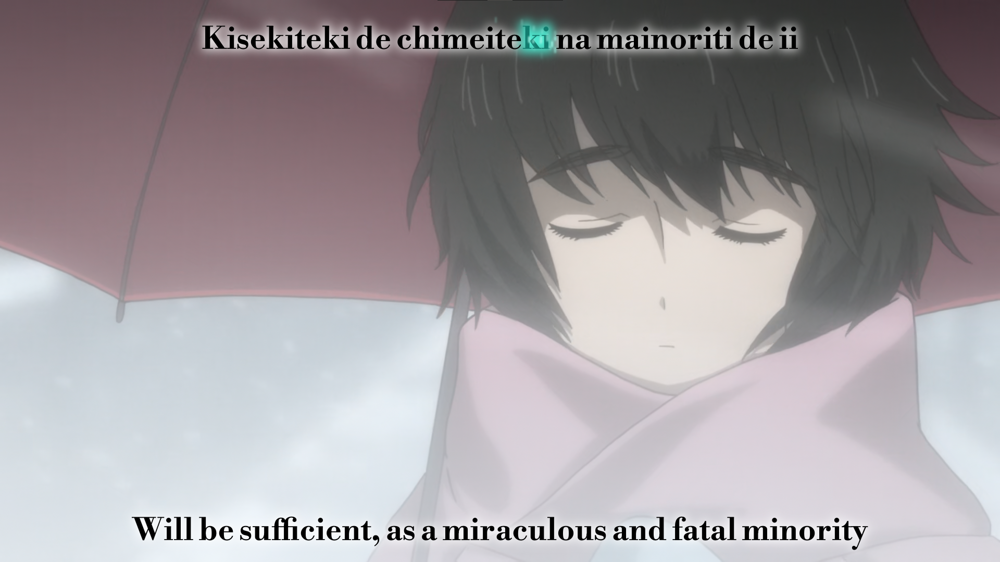
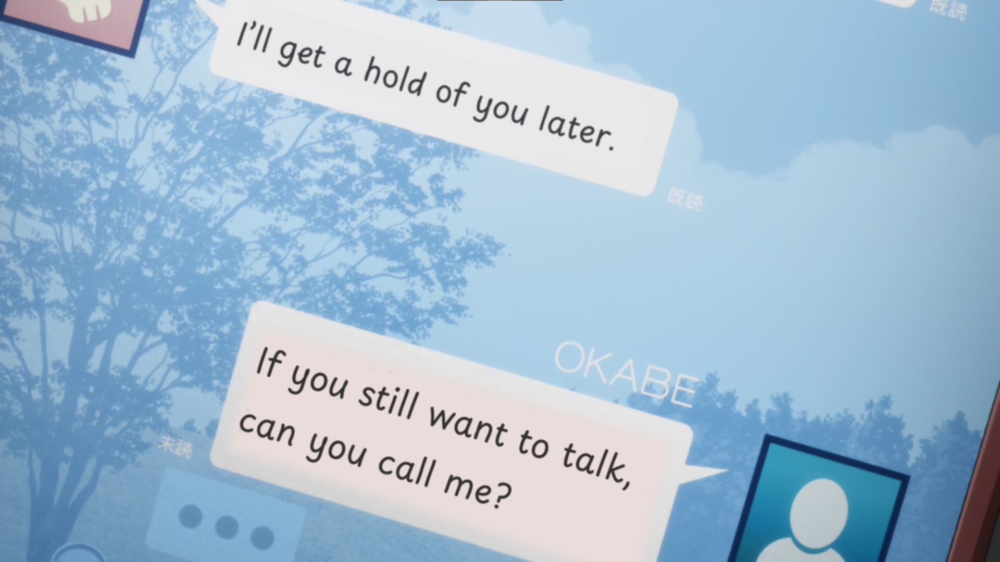
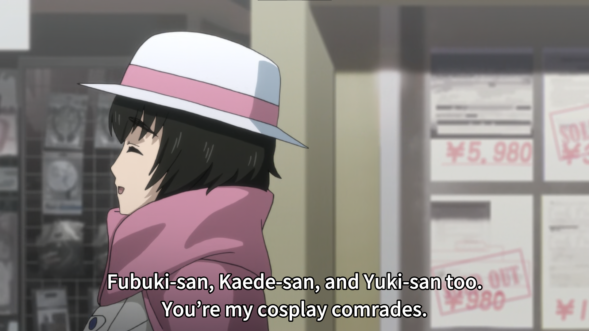

# Steins;Gate 0 [StyledHorribleFix] subtitles
These subtitles are a fork of the [[HorribleFix]](https://bitbucket.org/Woote/horriblefix) subtitles, edited to place the signs in the scene, style the songs and update terminology to remain consistent with the current [Committee of Zero patches](http://sonome.dareno.me/projects/sg0-steam.html).

> [!Note]
> This project is in no way officially associated with HorribleSubs, HorribleFix or the Committee of Zero.

### Motivation
The [HorribleFix] subtitles do a great job at keeping the terminology consistent between the Steins;Gate 0 visual novel (with the CoZ patch), and the anime adaptation. These subtitles, based on the [HorribleSubs] release, however, have all in-world Japanese text translated in quotes on top of the screen. This release attempts to place this text in the world, laying on top of the original Japanese text, to provide a more seamless experience.

In addition to that, this release also tries to improve consistency with the CoZ patches wherever possible, as well as simply improving the translation in other small ways.

### Contact
Have you found an issue with the subs, big or small? Found something that could be improved on? An inconsistency with the Committee of Zero patches? Something else? Feel free to open an issue, or a pull request!

You can contact me on Discord under the username `pringlesgang`.

# Contents
- [Preview](#preview)
- [Features](#features)
- [How to use](#how-to-use)
    - [Downloading the release](#downloading-the-release)
    - [Building from source](#building-from-source)
    - [Targeting the TV release](#targeting-the-tv-release)
- [Credits](#credits)

# Preview
- All songs are fully translated and styled!

- In-world text is translated and rendered on top of the video!

- The text is consistent with the visual novel!
![Amadeus Kurisu is addressed as [Kurisu]](./preview/vn.png "In the visual novel, Amadeus Kurisu is always addressed as ‘[Kurisu].’")
- Honorifics are back!

# Features
### Translated and styled signs
Steins;Gate 0 often makes use of RINE messages in place of spoken dialogue, which is, of course, [in Japanese](https://youtu.be/5emC3_P-i7o). In these cases (as well as other cases of important unspoken Japanese), the original text will have been obscured, with the English translation overlayed on top, resulting in a seamless watching experience!

### Translated songs
All songs have been meticulously translated and styled. The Committee of Zero translation were taken for those songs that (in-part) have them, with all other songs fully retranslated, paying close attention to connections made to the series.

These songs have also been styled and karaoke-timed, to look as beautiful as possible!

### Restored Japanese honorifics
The Steins;Gate 0 visual novel has restored honorifics, thanks to the Committee of Zero, so why shouldn't these anime subtitles? Every instance of an honorific being used in the original Japanese has been copied over into the English script.

### Visual novel and Committee of Zero consistency
These subtitles have been thoroughly edited to match the Committee of Zero's visual novel patches as closely as possible. Examples are:
- Sticking to established Science Adventure terminology (like *worldline* and *world layer*)
- Name order and romanization (Okabe Rintaro instead of Rintarou Okabe)
- [Restored Japanese honorifics](#restored-japanese-honorifics)
- Textual stylistic choices (e.g. writing ‘[Kurisu]’ when referring to *Amadeus* Kurisu)
- Keeping in-universe brand names (like Dr P)

### Improved typography
All instances of en-dashes and em-dashes have been replaced with their respective single-character counterparts (– and —, instead of - and --), and all quotes and apostrophes have been replaced with their directed counterparts, to improve readability.

In addition to this, the default styling uses the [Noto Sans Japanese](https://fonts.google.com/noto/specimen/Noto+Sans+JP) font at medium style with a black stroke, for easy readability from the couch!

# How to use
These subtitles target the [Anime Time] release, though through some minor temporal tweaking it could easily be adjusted for other releases as well.

> [!TIP]
> These subtitles are best played with [mpv](https://mpv.io)!

## Downloading the release
Download the latest release under the [**Releases**](https://github.com/PringlesGang/SG0-HorribleStyledFix/releases) section. This zip file will include three folders:
- `fonts` contains all fonts used in the project
- `full` contains the full subtitles, intended for Japanese audio
- `ss` contains the signs+songs subtitles, intended for English audio

In addition to this, there is also a PowerShell script [`auto-mkv-subs.ps1`](./auto-mkv-subs.ps1) for Windows and a Bash script [`auto-mkv-subs.sh`](./auto-mkv-subs.sh) for Linux and macOS.

To use these subtitles, either install each font on your machine, or merge them into each episode's video file [using the automated merging script](#using-the-automated-merging-script).
A comprehensive list of what fonts are used in what episodes can be found in [`fonts.md`](./fonts.md).

### Using the automated merging script
The automated merging script will take all anime episodes as input, and spit out those same files with their respective subtitles and fonts injected, making them perfectly playable straight from the video file!

To use this, first make sure that the `auto-mkv-subs` script is in a directory that has the subdirectories `fonts`, `full` and `ss`, containing the fonts, full subtitles and signs+songs subtitles respectively.

Next, create a fourth folder called `anime`. In this folder, copy all Steins;Gate 0 episodes from the [Anime Time] release.

> [!CAUTION]
> Make sure none of the files are renamed.

Finally, if you're on Windows, right-click on the [`auto-mkv-subs.ps1`](./auto-mkv-subs.ps1) script, and select `Run with PowerShell`. If you're on Linux or macOS instead, run the [`auto-mkv-subs.sh`](./auto-mkv-subs.sh) script with Bash. The injected video files should slowly start to appear in the newly generated `output` folder.

## Building from source
To make better use of source-control, the source subtitle files in this repository are not compiled, meaning some stylings only exist as Aegisub templates, and not as actual lines. To compile these files, open them in [Aegisub](https://aegisub.org/), and compile by clicking the `Automation -> Apply karaoke template` button.

The repository contains three blacklist files: [`decompile-blacklist.txt`](./ssa-cleanup-filters/decompile-blacklist.txt), [`release-blacklist.txt`](./ssa-cleanup-filters/release-blacklist.txt) and [`signsSongs-blacklist.txt`](./ssa-cleanup-filters/signsSongs-blacklist.txt). These are to be used with my [ssa-cleanup-tool](https://github.com/PringlesGang/ssa-cleanup-tool).
- [`decompile-blacklist.txt`](./ssa-cleanup-filters/decompile-blacklist.txt) removes all lines with the `fx`-effect—all compiled lines. Used for decompiling to place under source control.
- [`release-blacklist.txt`](./ssa-cleanup-filters/release-blacklist.txt) removes all comment lines. Used for debloating the public release.
- [`signsSongs-blacklist.txt`](./ssa-cleanup-filters/signsSongs-blacklist.txt) removes all lines that either have the `Default` or `On Top` style—all dialogue; leaving only the signs and the songs. Used for creating _signs+songs_ subtitles for dubbed audio.

All fonts used, as well as their download links, are found in the [`fonts.md`](./fonts.md) file.

## Targeting the TV release
These subtitles target the Blu-ray release, which changed some of the animation. This means that if you wish to target a TV release (such as the HorribleSubs release), some stylings will need to be altered. These alterations can be found in [`TV-alterations.md`](./TV-alterations.md).

# Credits
Special thanks to the following people, without whom this project wouldn't have been possible!

- Mia - Worked on the original [HorribleFix] release, and helped me with the *World-Line* song translation.
- Woute - Worked on the original [HorribleFix] release.
- Committee of Zero - Provided song translations for *A Song for the Stars* and *Gate of Steiner*, plus the first part of *Amadeus* and *Lyra*, as well as the chorus and stylings for *Skyclad Observer*. They are also, of course, to be thanked for the terminology this project strives to be consistent with!
